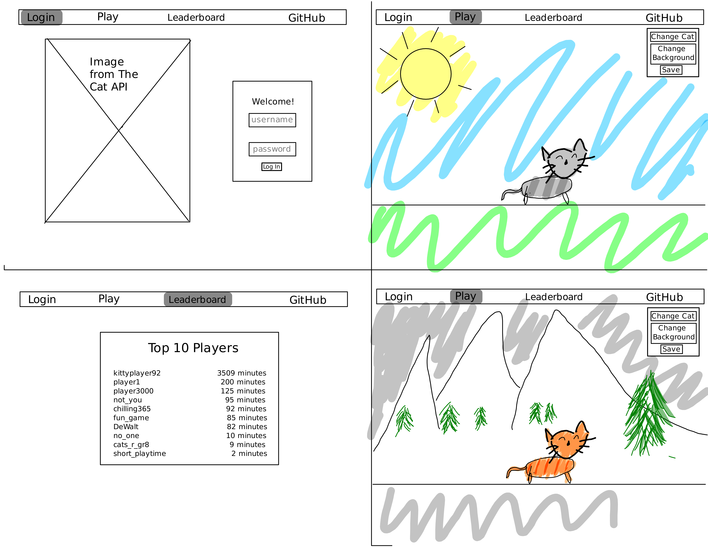

# Walking Cat Simulator

[My Notes](notes.md)

This is a simple web application that provides peace as a cat walks across different environments on your screen. You can customize your cat and the environment to your liking to ensure peak enjoyment.

> [!NOTE]
>  This is a template for your startup application. You must modify this `README.md` file for each phase of your development. You only need to fill in the section for each deliverable when that deliverable is submitted in Canvas. Without completing the section for a deliverable, the TA will not know what to look for when grading your submission. Feel free to add additional information to each deliverable description, but make sure you at least have the list of rubric items and a description of what you did for each item.

> [!NOTE]
>  If you are not familiar with Markdown then you should review the [documentation](https://docs.github.com/en/get-started/writing-on-github/getting-started-with-writing-and-formatting-on-github/basic-writing-and-formatting-syntax) before continuing.

## 🚀 Specification Deliverable

> [!NOTE]
>  Fill in this sections as the submission artifact for this deliverable. You can refer to this [example](https://github.com/webprogramming260/startup-example/blob/main/README.md) for inspiration.

For this deliverable I did the following. I checked the box `[x]` and added a description for things I completed.

- [x] Proper use of Markdown
- [x] A concise and compelling elevator pitch
- [x] Description of key features
- [x] Description of how you will use each technology
- [x] One or more rough sketches of your application. Images must be embedded in this file using Markdown image references.

### Elevator pitch

Do you like cats? Do you like peaceful moments with cats? Then play Walking Cat Simulator! This is a simple web browser game that allows you to walk as a cat across different environments. You can change what type and color of cat you have and can even save your preferred cat and environment. Come join and enjoy your peaceful cat walk!

### Design

### Key features

- Secure login over HTTPS
- Ability to select cat and background
- Ability for user to save their preferred cat and background
- Cat images from The Cat API
- Leaderboard of top 10 time spent played by user

### Technologies

I am going to use the required technologies in the following ways.

- **HTML** - Uses correct HTML structure for application. Three HTML pages: one for login, one for the game, and one for the leaderboard. Hyperlinks to pages.
- **CSS** - Application styling and applying sprites to play page and background. Adjusting size based on screen size and follows good color choice and design.
- **React** - Provides login, cat and background changes, backend endpoint calls
- **Service** - Backend service with endpoints for:
    - retrieving saved user background and cat info
    - leaderboard
    - displays a random cat picture using https://api.thecatapi.com/v1/images/search service.
- **DB/Login** - Store users, background and cat saves, and time played in database. Register and login users. Credential securly stored in database. Cannot save or be on leaderboard unless authenticated.
- **WebSocket** - As each user saves their cat and background information, their choice is broadcast to all other users.

## 🚀 AWS deliverable

For this deliverable I did the following. I checked the box `[x]` and added a description for things I completed.

- [x] **Server deployed and accessible with custom domain name** - [My server link](https://derekawalton.com/).

## 🚀 HTML deliverable

For this deliverable I did the following. I checked the box `[x]` and added a description for things I completed.

- [x] **HTML pages** - Four different pages. One for each view. `index.html` (Login), `play.html`, `scores.html`, and `about.html`.
- [x] **Proper HTML element usage** - I used header, footer, main, nav, img, a, p, input, button, form, among others.
- [x] **Links** - Links between views and one to the GitHub repository.
- [x] **Text** - About page has text.
- [x] **3rd party API placeholder** - About page has a place to display an image from thecatapi.com. Currently it even includes one of the images from the cat api, a cat within a sink.
- [x] **Images** - Image of the cat I grew up with and an image from thecatapi.com is displayed on the about page. Also have placholder images for the game on play page
- [x] **Login placeholder** - Placeholder for auth is on the login page.
- [x] **DB data placeholder** - High scores displayed on scores page. The play page has a button to save the cat and the background to one's profile
- [x] **WebSocket placeholder** - The play page has a text area that will show other user notifications.

## 🚀 CSS deliverable

For this deliverable I did the following. I checked the box `[x]` and added a description for things I completed.

- [ ] **Header, footer, and main content body** - I did not complete this part of the deliverable.
- [ ] **Navigation elements** - I did not complete this part of the deliverable.
- [ ] **Responsive to window resizing** - I did not complete this part of the deliverable.
- [ ] **Application elements** - I did not complete this part of the deliverable.
- [ ] **Application text content** - I did not complete this part of the deliverable.
- [ ] **Application images** - I did not complete this part of the deliverable.

## 🚀 React part 1: Routing deliverable

For this deliverable I did the following. I checked the box `[x]` and added a description for things I completed.

- [ ] **Bundled using Vite** - I did not complete this part of the deliverable.
- [ ] **Components** - I did not complete this part of the deliverable.
- [ ] **Router** - Routing between login and voting components.

## 🚀 React part 2: Reactivity

For this deliverable I did the following. I checked the box `[x]` and added a description for things I completed.

- [ ] **All functionality implemented or mocked out** - I did not complete this part of the deliverable.
- [ ] **Hooks** - I did not complete this part of the deliverable.

## 🚀 Service deliverable

For this deliverable I did the following. I checked the box `[x]` and added a description for things I completed.

- [ ] **Node.js/Express HTTP service** - I did not complete this part of the deliverable.
- [ ] **Static middleware for frontend** - I did not complete this part of the deliverable.
- [ ] **Calls to third party endpoints** - I did not complete this part of the deliverable.
- [ ] **Backend service endpoints** - I did not complete this part of the deliverable.
- [ ] **Frontend calls service endpoints** - I did not complete this part of the deliverable.

## 🚀 DB/Login deliverable

For this deliverable I did the following. I checked the box `[x]` and added a description for things I completed.

- [ ] **User registration** - I did not complete this part of the deliverable.
- [ ] **User login and logout** - I did not complete this part of the deliverable.
- [ ] **Stores data in MongoDB** - I did not complete this part of the deliverable.
- [ ] **Stores credentials in MongoDB** - I did not complete this part of the deliverable.
- [ ] **Restricts functionality based on authentication** - I did not complete this part of the deliverable.

## 🚀 WebSocket deliverable

For this deliverable I did the following. I checked the box `[x]` and added a description for things I completed.

- [ ] **Backend listens for WebSocket connection** - I did not complete this part of the deliverable.
- [ ] **Frontend makes WebSocket connection** - I did not complete this part of the deliverable.
- [ ] **Data sent over WebSocket connection** - I did not complete this part of the deliverable.
- [ ] **WebSocket data displayed** - I did not complete this part of the deliverable.
- [ ] **Application is fully functional** - I did not complete this part of the deliverable.
